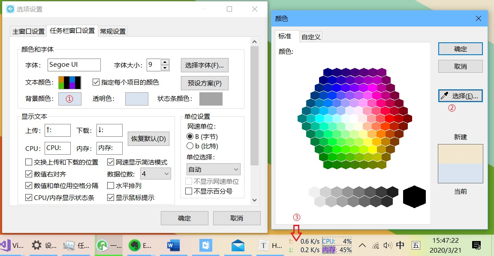

**简体中文 | [English](https://github.com/zhongyang219/TrafficMonitor/blob/master/Help_en-us.md)** 
# TrafficMonitor 帮助
### 1. 如何显示CPU和内存利用率？
在主窗口点击右弹出键菜单，勾选“显示更多信息”。如果需要在任务栏窗口中也显示CPU和内存利用率，则在任务栏窗口中点击右键弹出菜单，勾选“显示CPU和内存利用率”即可。
### 2. 如何单独设置任务栏窗口中每个项目的颜色？
在右键菜单中选择“选项”，切换到“任务栏窗口设置”，勾选“指定每个项目的颜色”，此时再点击“文本颜色”右边的颜色块，就会弹出“任务栏窗口颜色设置”的对话框了。 
如果不勾选“指定每个项目的颜色”，则只能为文本设置统一的颜色。
### 3. 设置了开机自动运行仍然无法开机自启。
程序的开机启动功能是通过在注册表“计算机\HKEY_CURRENT_USER\Software\Microsoft\Windows\CurrentVersion\Run”中创建“TrafficMonitor”的注册表项来实现的，如果你遇到无法开机启动的问题，请先检查该注册表项是否存在，再检查程序的路径是否正确。如果你移动了程序的位置，则会因为路径无效导致开机自启动失效，此时只需要在选项设置中取消“开机自动运行”的勾选，再将其勾选上就可以了。 
如果设置了以管理员身份运行也会出现开机无法自启动的问题，请尝试去掉以管理员身份运行。 
### 4. 在Win10 1803下，如果设置了使用UTF8为系统默认编码，则无法使用微软雅黑字体。
在这种情况下，如果设置字体为微软雅黑，则下次启动后，字体会变成宋体，选项设置中看到字体名称变成了“微软雅”。
将系统编码设置成UTF8编码后，不知道什么原因，使得Windows写入ini文件的API函数会出现某些中文字符被截断的问题。
如果出现这种情况，请直接在“字体”后面的文本框内输入微软雅黑的英文名称“Microsoft YaHei”。当然也可以直接使用Microsoft YaHei UI字体。
### 5. 程序弹出“无法保存设置”的对话框。
对于V1.72及以前的版本，如果遇到这种情况，说明程序没有向其所在目录下写入数据的权限，导致设置数据无法保存。如果遇到这种情况，请将程序移动到其他有写入权限的文件夹中。 
在V1.73以后的版本中，由于配置文件已经移动到了C:\Users\用户名\AppData\Roaming\TrafficMonitor目录下，理论上应该不会出现这种问题了。如果这个问题仍然出现，请尝试把C:\Users\用户名\AppData\Roaming\TrafficMonitor\config.ini删除，该文件会在删除后重新生成。
### 6. 多显示器时悬浮窗只能在主显示器中显示。
默认情况下做了让悬浮窗无法超出屏幕边界的处理，如果需要将悬浮窗移动到其他显示器，请在悬浮窗中点击右键弹出菜单，选择“其他功能”，勾选“允许超出屏幕边界”，此时悬浮窗不再限制在屏幕内，也能移动到任意显示器中了。 
如果移除额外的显示器，那么悬浮窗可能会出现在屏幕区域外导致不可见，此时只需要在通知区域图标上点击鼠标右键，选择“其他功能”，去掉“允许超出屏幕边界”的勾选，悬浮窗就会重新出现屏幕范围内了。
### 7. 网速数值显示不全。
由于不同字体每个字符的宽度并不一样，在某些情况下，确实会出现网速数值显示不全的问题。如果出现了这样的问题，请打开“选项”——“任务栏窗口设置”，在“数据位数”下拉列表中选择一个更大的值。
### 8. 设置了鼠标穿透后如何取消？
在通知区的TrafficMonitor的图标上点击鼠标右键，去掉“鼠标穿透”的勾选即可。 
设置了鼠标穿透后，悬浮窗将无法响应任何鼠标消息，也无法弹出右键菜单，但是可以通过通知区图标来弹出右键菜单。主窗口的右键菜单和通知区图标的右键是完全一样的。 
另外，即使你之前设置了隐藏通知区图标，开启鼠标穿透后，通知区图标也会自动显示出来，防止无法弹出右键菜单。 
说明：以下几种情况下通知区图标会自动显示出来： 
* 开启鼠标穿透后；
* 不显示任务栏窗口的情况下隐藏主窗口后；
* 隐藏主窗口的情况下关闭任务栏窗口后；
* 开启鼠标穿透的情况下关闭任务栏窗口后。
### 9. Windows 10 白色任务栏主题时任务栏窗口颜色的问题

在使用白色任务栏主题时，你可以在在“任务栏窗口设置”点击“预设方案”按钮，选择“浅色模式”，可以一键设置浅色模式任务栏颜色。如图所示：

但是如果你遇到了点击任务栏窗口空白区域（下图中“3”处的箭头指向的区域）会弹出任务栏右键菜单而不是TrafficMonitor右键菜单的问题，你可以尝试以下步骤：

1. 点击“背景颜色”，弹出“颜色”对话框。
2. 点击“选择”按钮从屏幕选取一个颜色。
3. 选择任务栏窗口空白区域的颜色（图中“3”处的箭头指向的区域）。（是的，不用管任务栏是否透明，也不用管你的壁纸是什么颜色，直接选取就好，我也不知道为什么。。。）
4. 将透明色设置成和刚刚背景颜色完全一样的颜色。

这样做之后点击任务栏窗口空白区域就可以正常弹出TrafficMonitor的右键菜单了，即使更换壁纸或重启电脑仍然有效。

### 10. 在Win7/Win8/Win8.1下任务栏窗口有个背景色，无法完全透明
这个问题确实存在，但是在Win10下是正常的。这个问题暂时无法解决。
### 11. 任务栏窗口有时会显示不全，比如单位被覆盖了
这确实是一个BUG，但是我目前还没有找到一个好的解决方法，这个问题通常出现在任务栏右侧通知区域宽度变化的时候，主要在在切换输入法的时候，如果出现了这个问题，可以将通知区任意一个图标向上拖动将其隐藏，再将其拖下来即可恢复正常。 
出现这个问题原因在于，由于系统任务栏通知区的图标数量可能会发生变化，导致通知区的宽度也会时常变化，当通知区的宽度发生变化时，TrafficMonitor的任务栏窗口需要实时调整其位置。但是由于我无法知道通知区的宽度在什么时候变化，因此只能每隔一段时间判断是否需要调整位置，如果任务栏通知区域的宽度变化得太快，就会导致TrafficMonitor的任务栏无法及时调整其位置，从而导致了这个BUG。 
#### 以下步骤或许可以解决这个问题： 
* 打开“设置”
* 点击“时间和语言”——“区域和语言”
* 点击右侧“高级键盘设置”
* 勾选“使用桌面语言栏”
* 右键点击任务栏，选择“任务栏设置”
* 点击“打开或关闭系统图标”，关闭“输入指示” 
方法来自知乎 [win10的任务栏为何一点击就乱动？](https://www.zhihu.com/question/312032145/answer/627965084) 

 

>如果还遇到其他问题，请点击“关于”对话框中的“联系作者”，或者直接[点击此处](mailto:zhongyang219@hotmail.com)向我发送电子邮件。但我由于作者的能力有限，我并不能保证可以解决所有问题，但是你的反馈也许可以帮助我更好的改进这个软件。 
请在邮件中尽可能详细地描述你遇到的问题，出现了什么错误提示，你尝试过哪些操作等，最好能够附上截图和配置文件（“选项”——“常规设置”——“打开配置文件所在路径”）。 
注意，发送前请先确认一下你发送时使用的电子邮件地址，如果你的邮件地址是形如“outlook_随机字符串@outlook.com”的格式，那么这样的邮箱地址是无法回复的。
这可能是由于你使用了第三方邮箱地址作为Microsoft账号登录Windows导致的。如果有这样的情况，请务必在邮件中附上正确的电子邮件地址。
