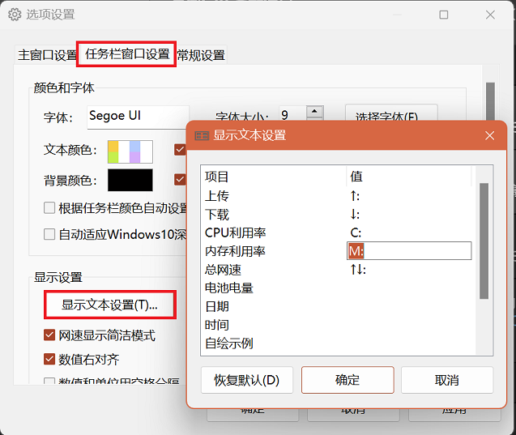
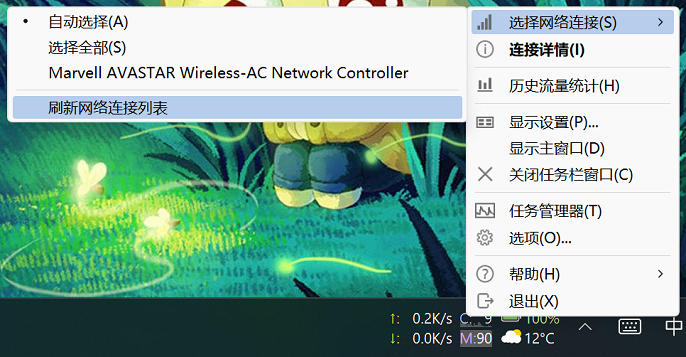
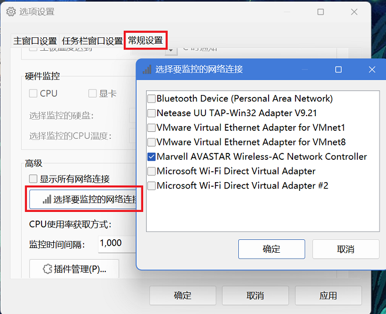
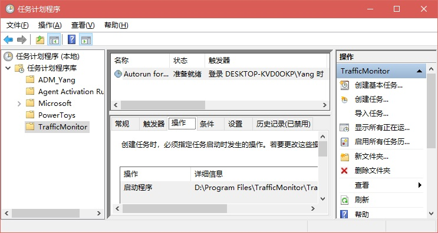

**简体中文 | [English](./Help_en-us.md)**

# TrafficMonitor 常见问题
这里是关于TrafficMonitor常见问题的页面，如果你想查看关于TrafficMonitor的各项功能和使用方法的详细介绍，请[点击这里](https://github.com/zhongyang219/TrafficMonitor/wiki)转到TraffinMonitor Wiki页面。

### Windows11使用1.84版本时“任务栏窗口显示在任务栏的左侧”选项无效

在1.84版本中，如果任务栏窗的对齐方式为左对齐时，则任务栏窗口总是显示在右侧，因为显示在左侧时会和任务栏原来的按钮重叠。
而程序检测任务栏对齐方式是通过读取注册表`\HKEY_CURRENT_USER\Software\Microsoft\Windows\CurrentVersion\Explorer\Advanced`下`TaskbarAl`的键值来获取的，但是如果你从来没有更改过任务栏的对齐设置，这个键值就不存在，此时TrafficMonitor会误以为任务栏是左对齐，这是一个bug。解决的办法是：
在任务栏上点击鼠标右键，选择任务栏设置，更改一次任务栏对齐方式，生成以上键值后，比如将“居中”改为“左对齐”，再改回“居中”就好了。
如果没有得到解决请检查是否存在TaskbarDa键值，没有的话请添加此键值。

### 如何显示CPU和内存利用率？

在主窗口点击右弹出键菜单，勾选“显示更多信息”。如果需要在任务栏窗口中也显示CPU和内存利用率，则在任务栏窗口中点击右键弹出菜单，在“显示设置”子菜单下勾选“CPU和内存利用率”即可。

### 如何更改任务栏中“CPU”、“内存”等文本

任务栏窗口中的标签文本是可以自定义的。点击鼠标右键，在右键菜单中选择“选项”，点击“任务栏窗口设置”，点击“显示文本设置”，双击项目右侧的文本即可更改，然后点击两次“确定”即可。



由于这些文本是可以自定义的，因此切换语言时不会自动更改。在切换语言后，你可以点击“显示文本”对话框中的“恢复默认”按钮。

### 网速一直显示为0KB

这种情况可能是因为你电脑中正在使用的网卡发生了切换导致的。

点击右键菜单“选择网络连接”下面的“刷新网络连接列表”也许可以解决这个问题。



如果问题仍然存在，请尝试在“选择网络连接”的子菜单下选择你要监控的网络连接，而不是选择“自动选择”。

如果问题仍然存在，请尝试在“选项设置”>“常规设置”>“高级”中点击“选择要监控的网络连接”按钮，在弹出的对话框中只勾选你想监控的网络连接，去掉其他项目的勾选，点击两次“确定”按钮即可。



### 如何单独设置任务栏窗口中每个项目的颜色？
在右键菜单中选择“选项”，切换到“任务栏窗口设置”，勾选“指定每个项目的颜色”，此时再点击“文本颜色”右边的颜色块，就会弹出“任务栏窗口颜色设置”的对话框了。

如果不勾选“指定每个项目的颜色”，则只能为文本设置统一的颜色。

### 设置了开机自动运行仍然无法开机自启。
从1.80版本开始，包含温度监控的版本和不含温度监控的版本采用了不同的方式来实现开机自启动。

* 不含温度监控的版本和1.80以前的版本：

  不含温度监控的版本和1.80以前的版本的开机启动功能是通过在注册表“计算机\HKEY_CURRENT_USER\Software\Microsoft\Windows\CurrentVersion\Run”中创建“TrafficMonitor”的注册表项来实现的，如果你遇到无法开机启动的问题，请先检查该注册表项是否存在，再检查程序的路径是否正确。如果你移动了程序的位置，则会因为路径无效导致开机自启动失效，此时只需要在选项设置中取消“开机自动运行”的勾选，再将其勾选上就可以了。<br>

  注意，某些第三方安全软件可能会阻止TrafficMonitor的开机自启动，请尝试在安全软件中允许TrafficMonitor开机自启动。

  如果设置了以管理员身份运行也会出现开机无法自启动的问题，请尝试去掉以管理员身份运行。<br>

* 包含温度监控的版本：

  包含温度监控的版本是通过创建任务计划来实现开机自启动的。可以通过`控制面板\系统和安全\管理工具`来打开任务计划程序。

  如下图所示：

  

  如果你遇到无法开机自启动的情况，请到“任务计划程序”中检查TrafficMonitor的计划任务是否正常创建，exe文件的路径是否正确。

开机无法自启动的一个常见原因是你可能移动了TrafficMonitor主程序的位置。如果你为TrafficMonitor设置好了开机自动运行，但是你将TrafficMonitor移动到了其他位置，那么开机自启动肯定就失效了。你需要打开TrafficMonitor的“选项设置”——“常规设置”，如果“开机时自动运行”处于勾选状态，先去掉勾选，然后再次打开“选项设置”——“常规设置”，重新勾选“开机时自动运行”即可。

需要注意的是，如果你使用不含温度监控的版本在注册表中创建了开机自启动项，然后再使用包含温度监控的版本开启开机自启动功能，它会自动将注册表中的开机自启动项删除，再在任务计划中创建开机自启动项。反之亦然。

### 程序弹出“无法保存设置”的对话框。
如果遇到这种情况，说明程序没有向其所在目录下写入数据的权限，导致设置数据无法保存。尝试将程序移动到其他有写入权限的文件夹中可以解决这个问题。

你也可以通过以下步骤将配置文件的保存路径改为C:\Users\\<用户名\>\AppData\Roaming\TrafficMonitor目录。<br>

* 退出TrafficMonitor，以管理员身份重新启动TrafficMonitor。
* 在右键菜单中选择“选项”，切换到“常规设置”选项卡，在“数据和配置文件”中选择“保存到Appdata目录”。<br>

如果此时仍然提示“无法保存设置”，请打开应用程序所在目录，打开`global_cfg.ini`文件，如果不存在请新建一个，在里面添加如下内容：

```
[config]
portable_mode = true
```

如果无法新建，可以在其他位置（比如桌面）新建该文件，然后移动到程序所在目录。

如果`global_cfg.ini`文件已存在，就把`portable_mode `的值改成`true`，保存后重新启动TrafficMonitor。

如果`global_cfg.ini`没有写入权限，可以尝试把该文件复制到桌面，改好后复制回原来的路径将原文件覆盖。

执行以上步骤后理论上应该不会出现这种问题了。如果这个问题仍然出现，请尝试把C:\Users\\<用户名\>\AppData\Roaming\TrafficMonitor\config.ini删除，该文件会在删除后重新生成。

在1.79以后的版本中，如果程序所在目录无法写入数据，会自动将配置和数据文件保存到C:\Users\\<用户名\>\AppData\Roaming\TrafficMonitor目录，此时，“选项”——“常规设置”——“数据和配置文件”中“保存到程序所在目录”将不可用。

### 更改设置后下次开机时设置丢失

如果你没有看到“无法保存设置”的对话框，则说明程序的配置文件是能正常保存的。因此这个问题的原因可能是你的电脑中存在了多个TrafficMonitor的程序文件，并且配置文件保存在了程序所在目录下。

例如，你打开了“D:\software\TrafficMonitor\TrafficMonitor.exe”，并且更改了选项设置，但是下次开机时启动的却是“D:\software1\TrafficMonitor\TrafficMonitor.exe”，而你之前修改的配置被保存在了“D:\software\TrafficMonitor\”目录下。

解决这个问题的方法是：

1. 在“选项设置”>“常规设置”>“配置和数据文件”中，将配置文件的保存位置更改为Appdata目录。
2. 删除你电脑中不需要的TrafficMonitor的程序文件，启动TrafficMonitor后，打开“选项设置”>“常规设置”，点击“重新设置开机自动运行”按钮。

### 多显示器时悬浮窗只能在主显示器中显示。
默认情况下做了让悬浮窗无法超出屏幕边界的处理，如果需要将悬浮窗移动到其他显示器，请通过右键菜单打开“选项”>“主窗口设置”，勾选“允许超出屏边界”，点击“确定”按钮，此时悬浮窗不再限制在屏幕内，也能移动到任意显示器中了。

如果移除额外的显示器，那么悬浮窗可能会出现在屏幕区域外导致不可见，此时只需要在通知区域图标上点击鼠标右键，选择“选项”，在“主窗口设置”中去掉“允许超出屏幕边界”的勾选，悬浮窗就会重新出现屏幕范围内了。

### 网速数值显示不全。
由于不同字体每个字符的宽度并不一样，在某些情况下，确实会出现网速数值显示不全的问题。如果出现了这样的问题，请打开“选项”——“任务栏窗口设置”，在“数据位数”下拉列表中选择一个更大的值。
### 设置了鼠标穿透后如何取消？
在通知区的TrafficMonitor的图标上点击鼠标右键，去掉“鼠标穿透”的勾选即可。<br>
设置了鼠标穿透后，悬浮窗将无法响应任何鼠标消息，也无法弹出右键菜单，但是可以通过通知区图标来弹出右键菜单。主窗口的右键菜单和通知区图标的右键是完全一样的。<br>
另外，即使你之前设置了隐藏通知区图标，开启鼠标穿透后，通知区图标也会自动显示出来，防止无法弹出右键菜单。<br>
说明：以下几种情况下通知区图标会自动显示出来：<br>

* 开启鼠标穿透后；
* 不显示任务栏窗口的情况下隐藏主窗口后；
* 隐藏主窗口的情况下关闭任务栏窗口后；
* 开启鼠标穿透的情况下关闭任务栏窗口后。
### Windows 10 白色任务栏主题时任务栏窗口颜色的问题

在使用白色任务栏主题时，你可以在在“任务栏窗口设置”点击“预设方案”按钮，选择“浅色模式”，可以一键设置浅色模式任务栏颜色。如图所示：


同时，你还可能勾选“自动适应Windows10深色/浅色主题”，程序会在Windows10深色/浅色主题更换时自动切换颜色方案。你可以点击“自动适应设置”按钮来配置在深色和浅色主题时分别使用哪个颜色预设。

### 在Windows7/Windows8/8.1下任务栏窗口有个背景色，无法完全透明
这个问题确实存在，但是在Win10下是正常的。这个问题暂时无法解决。

在1.79以后的版本中，Windows8/8.1下可以在“选项”——“任务栏窗口设置”中勾选“背景色透明”，再勾选“根据任务栏颜色自动设置背景色”即可获得较好的显示效果。

### 任务栏窗口有时会显示不全，比如单位被覆盖了
这确实是一个BUG，但是我目前还没有找到一个好的解决方法，这个问题通常出现在任务栏右侧通知区域宽度变化的时候，主要在在切换输入法的时候，如果出现了这个问题，可以将通知区任意一个图标向上拖动将其隐藏，再将其拖下来即可恢复正常。<br>
出现这个问题原因在于，由于系统任务栏通知区的图标数量可能会发生变化，导致通知区的宽度也会时常变化，当通知区的宽度发生变化时，TrafficMonitor的任务栏窗口需要实时调整其位置。但是由于我无法知道通知区的宽度在什么时候变化，因此只能每隔一段时间判断是否需要调整位置，如果任务栏通知区域的宽度变化得太快，就会导致TrafficMonitor的任务栏无法及时调整其位置，从而导致了这个BUG。

**以下步骤或许可以解决这个问题：**

* 打开“设置”
* 点击“时间和语言”——“区域和语言”
* 点击右侧“高级键盘设置”
* 勾选“使用桌面语言栏”
* 右键点击任务栏，选择“任务栏设置”
* 点击“打开或关闭系统图标”，关闭“输入指示”<br>
方法来自知乎 [win10的任务栏为何一点击就乱动？](https://www.zhihu.com/question/312032145/answer/627965084)<br>

### Windows10中开启HDR后任务栏窗口无法显示

部分用户反馈，在Windows10中开始HDR功能会导致任务栏窗口无法显示。如果遇到这个问题，可以尝试在[“选项设置”——“任务栏窗口设置”](https://github.com/zhongyang219/TrafficMonitor/wiki/选项设置#任务栏窗口设置)中关闭“背景透明”选项的勾选。

### CPU利用率显示和任务管理器不一致

在Windows10及以上操作系统中，如果你需要让TrafficMonitor显示的CPU利用率和任务管理器一致，请到[“选项设置”——“常规设置”——“高级”](https://github.com/zhongyang219/TrafficMonitor/wiki/选项设置#高级)——“CPU使用率获取方式”中选择“使用性能计数器”。

由于Windows10以上操作系统中任务管理器获取CPU利用率的方式发生了改变，因此选择“基于CPU使用时间”的方式获取到的CPU利用率会和任务管理器中显示的不一致。

### 关于TrafficMonitor温度监控的问题

由于温度监控功能在某些电脑中存在一些问题，因此温度监控功能默认是关闭的，如果你要使用TrafficMonitor的温度监控功能，请到[“选项设置”-“常规设置”-“硬件监控”](https://github.com/zhongyang219/TrafficMonitor/wiki/选项设置#硬件监控)中开启。开启后，任务栏右键菜单中的“显示设置”子菜单下才会出现温度相关的项目。

TrafficMonitor的温度监控功能依赖第三方开源库[LibreHardwareMonitor](https://github.com/LibreHardwareMonitor/LibreHardwareMonitor)。如果你遇到硬件温度无法显示，或者显示的温度异常的问题，请先下载LibreHardwareMonitor，并查看LibreHardwareMonitor是否能正常显示对应的温度。如果下载的最新版LibreHardwareMonitor可以正常监控到硬件温度，则将下载的LibreHardwareMonitor文件夹中的LibreHardwareMonitorLib.dll替换掉TrafficMonitor文件夹下的LibreHardwareMonitorLib.dll文件，即可解决温度无法检测的问题。

请不要向我反馈诸如温度显示不准确、显卡利用率不准确之类的问题，此类问题我无法解决。TrafficMonitor不是专业的硬件监控软件，无法保证硬件监控的数据在所有设备上的准确性。

**注意：硬件监控功能（包括温度监控和显卡使用率监控）可能存在一些问题，它可能会占用更多的CPU和内存。据部分用户反馈，开启温度功能后会导致程序崩溃和系统死机等问题，请在知晓以上风险后再决定开启硬件监控功能。否则，请不要使用硬件监控功能。**

## 程序启动时提示找不到“MSVC\*.dll”、“mfc\*.dll”、“vc*.dll”

点击以下链接下载并安装Microsoft Visual C++ 运行环境。

[最新支持的 Visual C++ 可再发行程序包下载 | Microsoft Docs](https://docs.microsoft.com/zh-CN/cpp/windows/latest-supported-vc-redist?view=msvc-170)


>如果遇到程序崩溃的问题，重新启动程序后，请先到“选项”——“常规设置”——“硬件监控”中关闭所有项目的硬件监控，因为基于用户提供的dmp文件发现，大多数崩溃问题都和硬件监控功能有关。和硬件监控功能相关的崩溃问题我无法解决，请不要向我发送邮件反馈。如果你排除了硬件监控的问题，但是崩溃问题仍然存在，请先到“选项”——“常规设置”——“高级”——“插件管理”中禁用所有插件，再重新启动程序。如果排除了插件的问题，但是崩溃问题仍然存在，请根据崩溃弹窗中的提示向我发送电子邮件。
>
>如果还遇到其他问题，也可以点击“关于”对话框中的“联系作者”，或者直接[点击此处](mailto:zhongyang219@hotmail.com)向我发送电子邮件。但我由于作者的能力有限，我并不能保证可以解决所有问题，但是你的反馈也许可以帮助我更好的改进这个软件。<br>
>请在邮件中尽可能详细地描述你遇到的问题，出现了什么错误提示，你尝试过哪些操作等，最好能够附上截图和配置文件（“选项”——“常规设置”——“打开配置文件所在路径”）。<br>
>注意，发送前请先确认一下你发送时使用的电子邮件地址，如果你的邮件地址是形如“outlook_随机字符串@outlook.com”的格式，那么这样的邮箱地址是无法回复的。
>这可能是由于你使用了第三方邮箱地址作为Microsoft账号登录Windows导致的。如果有这样的情况，请务必在邮件中附上正确的电子邮件地址。
