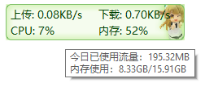

**简体中文 | [English](./README_en-us.md)**

# TrafficMonitor 简介

Traffic Monitor是一款用于Windows平台的网速监控悬浮窗软件，可以显示当前网速、CPU及内存利用率，支持嵌入到任务栏显示，支持更换皮肤、历史流量统计等功能。

# 相关链接：

请[点击此处](https://github.com/zhongyang219/TrafficMonitor/releases/latest)下载TrafficMonitor的最新版本。

备用链接：[百度网盘下载](https://pan.baidu.com/s/15PMt7s-ASpyDwtS__4cUhg) 提取码：`ou0m`

国内用户如果遇到Github下载缓慢的问题，可以[点击此处](https://gitee.com/zhongyang219/TrafficMonitor)转到此项目在Gitee上的页面。

如果遇到问题，请[点击此处](./Help.md)查看常见问题。

你也可以[点击此处](https://github.com/zhongyang219/TrafficMonitor/actions?query=workflow:"Release+CI")下载TrafficMonitor的预发行构建版本。

从1.80版本开始，TrafficMonitor加入了温度监控功能，如果你不需要温度监控功能，并且在使用1.80以上版本中遇到了问题，建议下载不含温度监控的版本（Lite版本）。（在Release页面找到文件名包含`Lite`的版本。）

TrafficMonitor依赖于Microsoft Visual C++ 运行环境，如果程序启动时提示“找不到MSVC*.dll”，请点击以下链接下载并安装Microsoft Visual C++ 运行环境。

[最新支持的 Visual C++ 可再发行程序包下载 | Microsoft Docs](https://docs.microsoft.com/zh-CN/cpp/windows/latest-supported-vc-redist?view=msvc-170)

# 版本说明

TrafficMonitor提供了标准版和Lite版两种版本可用。标准版包含了所有的功能，Lite版本则不包含温度监控、显卡利用率、硬盘利用率等硬件监控功能。标准版运行需要管理员权限，而Lite版本则不需要。

如果没有监控温度等硬件信息的需要，建议使用Lite版。

以下是两个版本功能对比。

| 功能                          | 标准版 | Lite版 |
| ----------------------------- | ------ | ------ |
| 网速监控                      | ✔      | ✔      |
| CPU、内存利用率          | ✔      | ✔      |
| CPU、显卡、硬盘、主板温度监控  | ✔      | ❌      |
| CPU频率监控 | ✔ | ✔ |
| 显卡利用率监控                | ✔      | ❌      |
| 硬盘利用率监控                | ✔      | ❌      |
| 网络详细信息                  | ✔      | ✔      |
| 插件系统                      | ✔      | ✔      |
| 主窗口更换皮肤                | ✔      | ✔      |
| 需要管理员权限                | 是     | 否     |

# 主要特性

* 显示当前实现网络传输速率、CPU和内存占用率
* 如果电脑有多个网卡，支持自动和手动选择网络连接
* 查看网络详细信息
* 支持嵌入到任务栏显示
* 支持更换皮肤和自定义皮肤
* 历史流量统计
* 硬件信息监控
* 插件系统
# 使用说明

**[点击这里](https://github.com/zhongyang219/TrafficMonitor/wiki)转到Wiki页面查看关于TrafficMonitor的详细说明文档。**

# 截图

主悬浮窗：

右键菜单：

任务栏窗口：

多彩皮肤：

# 如何使用
程序启动后在会在屏幕中显示一个显示网速的悬浮窗。在悬浮窗上点击鼠标右键可以弹出右键菜单。

TrafficMonitor支持将信息显示到任务栏。但是TrafficMonitor默认只显示主窗口（悬浮窗），如果需要让它嵌入到任务栏显示，请在右键菜单中选择“显示任务栏窗口”命令。

任务栏窗口支持自定义显示项目，默认情况下只显示网速，如果需要显示CPU和内存利用率等其他信息，请在任务栏窗口右键菜单中选择“显示设置”，在弹出的“显示设置”对话框中勾选需要显示的项目，如下图所示：

# 自定义皮肤

在主窗口或通知区图标右键菜单上选择“其他功能”——“更换皮肤”可以打开更换皮肤界面。[点击此处](https://github.com/zhongyang219/TrafficMonitorSkin/blob/master/皮肤下载.md)可以下载更多皮肤。用户还可以根据自己的需要编辑自己的皮肤。

皮肤文件放在程序所在目录的`skins`目录下，每个皮肤被放到单独的文件夹下，文件夹的名称就是皮肤的名称。

其中`background.bmp`和`background_l.bmp`是背景图片，`skin.ini`是皮肤的配置文件，可以通过`skin.ini`指定文本颜色、字体、皮肤作者、每个项目的大小和位置等信息。

从1.80版本开始增加了xml格式的皮肤配置文件`skin.xml`，只有xml格式的皮肤配置文件才支持温度和显卡使用率显示。

从1.85版本开始增加了对png格式背景图片的支持，你可以使用png格式来制作带透明背景的皮肤，背景图片的文件名为`background.png`和`background_l.png`。

详细的皮肤制作教程请点击以下链接：

[皮肤制作教程 · zhongyang219/TrafficMonitor Wiki (github.com)](https://github.com/zhongyang219/TrafficMonitor/wiki/皮肤制作教程)

# 选项设置

在右键菜单选择“选项...”可以进入选项设置。在选项设置对话框中，可以单独设置主窗口和任务栏窗口的文本颜色、字体、背景颜色、网速单位、显示的文本等。

在“常规设置”选项卡中，可以设置是否在程序时自动检查更新，以及是否需要在开机是自动运行。可以设置在什么时候需要发出消息通知。

从1.72版本开始，支持每个项目文本颜色单独设置。勾选“指定每个项目的颜色”后，点击“文本颜色”右边的颜色框，会弹出详细颜色设置的对话框，可以在这里单独指定每个项目的颜色。

# 插件系统

从1.82版本开始增加了插件系统，插件dll必须放在“TrafficMonitor.exe”同级目录的“plugins”目录下。程序启动后，插件会自动加载。你可以在右键菜单“更多功能”——“插件管理”中查看并管理已加载的插件。

关于如何开发TrafficMonitor的说明，请参见[插件开发指南 · zhongyang219/TrafficMonitor Wiki (github.com)](https://github.com/zhongyang219/TrafficMonitor/wiki/插件开发指南)。

要下载TrafficMonitor插件，请[点击这里](https://github.com/zhongyang219/TrafficMonitorPlugins/blob/main/download/plugin_download.md)。

# 关于硬件监控功能

从1.80版本开始，TrafficMonitor加入了硬件监控功能（包括温度监控和显卡使用率监控、CPU频率监控），它使用了第三方开源库[LibreHardwareMonitor](https://github.com/LibreHardwareMonitor/LibreHardwareMonitor)。如果你在使用温度监控功能时遇到了问题，请[点击这里](./Help.md#13-关于trafficmonitor温度监控的问题)。

需要注意的是，温度监控功能默认是关闭的，如果你要使用TrafficMonitor的温度监控功能，请到[“选项设置”-“常规设置”-“硬件监控”](https://github.com/zhongyang219/TrafficMonitor/wiki/选项设置#硬件监控)中开启。

**注意：硬件监控功能（包括温度监控和显卡使用率监控）可能存在一些问题，它可能会占用更多的CPU和内存。据部分用户反馈，开启温度功能后会导致程序崩溃和系统死机等问题，请在知晓以上风险后再决定开启硬件监控功能。否则，请不要使用硬件监控功能。**

# 更新日志

**[点击此处查看更新日志](./UpdateLog/update_log.md)**
