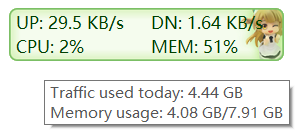
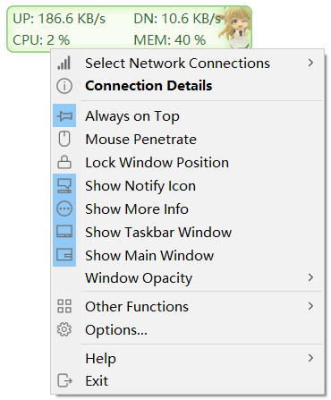
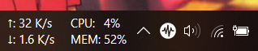
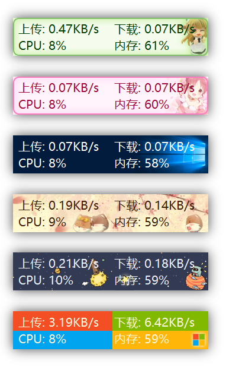
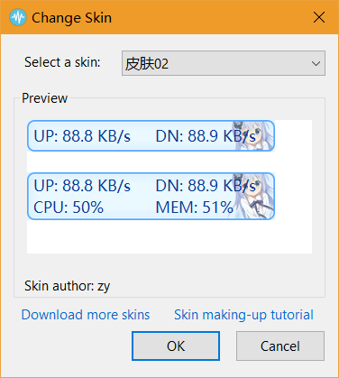
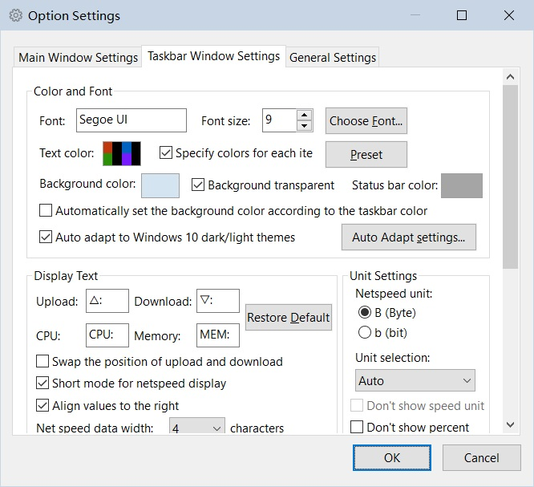
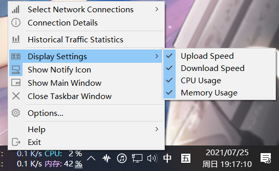
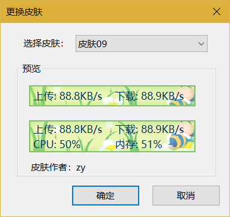

**[简体中文](./README.md) | English**

# TrafficMonitor Introduction

TrafficMonitor is a network monitoring software with floating window feature for Windows. It displays the current internet speed and CPU and RAM usage. There are also other capabilities like an embedded display in the taksbar, changeable display skins, and historical traffic statistics. 

# Related Links

Please [click here](https://github.com/zhongyang219/TrafficMonitor/releases/latest) to download the latest version of TrafficMonitor. 

Alternate link: Download from [Baidu Netdisk](https://pan.baidu.com/s/15PMt7s-ASpyDwtS__4cUhg). Access code: `ou0m`  

You can find the project page on Gitee by [clicking here](https://gitee.com/zhongyang219/TrafficMonitor)

If you encounter any problems, please [click here](./Help_en-us.md) for frequently asked questions.  

You can also [click here](https://github.com/zhongyang219/TrafficMonitor/actions?query=workflow:"Release+CI") to download the pre-release build version of TrafficMonitor.

For version 1.80 and later, the temperature monitoring function has been added. If the user does not need the temperature monitoring function and encounters problems with version 1.80 or later, it is recommended to download the earlier version without the temperature monitor (Lite version). (You can find the `Lite` version on the Release page.)

TrafficMonitor relies on the Microsoft Visual C++ operrating environment. If an error prompts "Cannot find MSVC*.dll" when the program starts, please click the link below to download and install the Microsoft Visual C++ operating environment.

[Download the latest supported version of Visual C++ Redistributable Package | Microsoft Docs](https://docs.microsoft.com/en-us/cpp/windows/latest-supported-vc-redist?view=msvc-170)

# Version description

There are two versions of TrafficMonitor, the standard version and the Lite version. The standard version includes all the functions, while the Lite version does not include hardware monitoring functions such as temperature monitoring, GPU usage, and hard disk usage. The standard version requires administrator privilege to run, while the Lite version does not. 

If there is no need to monitor the temperature and other hardware information, it is recommended to use the Lite version.

See below for the functions comparison of the two versions.

| Functions                                     | Standard Version | Lite Version |
| --------------------------------------------- | ---------------- | ------------ |
| Internet speed monitoring                     | ✔                | ✔            |
| CPU and RAM usage monitoring                  | ✔                | ✔            |
| CPU, GPU, hard disk, mother board temperature | ✔                | ❌            |
| CPU frequency monitoring                      | ✔                | ✔            |
| GPU usage monitoring                          | ✔                | ❌            |
| Hard disk usage monitoring                    | ✔                | ❌            |
| Network connection details                    | ✔                | ✔            |
| Plug-in system                                | ✔                | ✔            |
| Change the skin of the main window            | ✔                | ✔            |
| Administrator privilege required              | Yes              | No           |

# Main Features

* Displays current network transmission speed and CPU and RAM usage
* If multiple network adapters are available, users can automatically or manually select networks to connect 
* Display network connection details
* Support embedded display in taskbar
* Support skin change and customizable skins
* Historical traffic statistics
* Hardware information monitoring
* Plug-in system

# Instructions for use

**[Click here](https://github.com/zhongyang219/TrafficMonitor/wiki) to go to the Wiki page to view detailed documentation on TrafficMonitor (Only Available in Chinese).**

# Screen Shots

Main Floating Window:  
  
Right-Click Menu:  
  
Taskbar Window  

  

Colorful Skins:  

  

Change Skins:  

  

Options:  

  

# How to Use

As the program starts, a floating window showing network speed will appear on the screen. Right click on the floating window to open up the pop-up menu.

TrafficMonitor can display information on the taskbar. However, the default setting for TrafficMonitor shows only the main window (floating window), in order to show embedded display on the taskbar, right click the window and select "Show Taskbar Window" in the pop-up menu.

Users can customize displayed items on the embedded taskbar window. By default, only the network speed is displayed. In order to display CPU and RAM usage, or other informations, please select “Display Settings” in the right-click menu of the taskbar window, and check the items you want to display in the “Display Settings” dialog box, as shown below:

# Customizable Skin

You can select “Other Functions”-“Change Skin” on the right-click menu of the main window or notification area icon to open the interface of changing skin. Users can also download more skins and customize the skins [here](https://github.com/zhongyang219/TrafficMonitorSkin/blob/master/皮肤下载.md) according to their own needs.

Skin files are stored under the `skins` directory within the directory where the app is located. Each skin is stored in its individual folder and the name of the folder is the name of the skin. 

Among the files, `background.bmp` and `background_l.bmp` are background pictures，`skin.ini` is the configuration document for the skin, users can customize text colors, fonts, skin creator, and the size and location of each items etc. 

Since version 1.80, an xml format of skin configuration file `skin.xml` has been added. Without the xml skin configuration document, TrafficMonitor will not be able to display temperature and GUP usage.

Since version 1.85, support for background images in png format has been added, you can use the png format to create skins with transparent backgrounds. The file names of the background image files are `background.png` and `background_l.png`.

Click the link below for detailed instruction on skin making: 

[皮肤制作教程 · zhongyang219/TrafficMonitor Wiki (github.com)](https://github.com/zhongyang219/TrafficMonitor/wiki/皮肤制作教程)

# Configuring Options
 
Choosing "Options..." in the pop-up menu allows users to access the options configuration. In the dialog box of options configuration, the user can set the text color, text font, background color, net speed unit, and displayed text etc. for the main window and task window separately. 

In "Regular Configurations", users can change the settings on whether the program conducts auto-update and whether the program runs automatically when the computer starts up. Users can also configure when notifications need to be sent. 

For version 1.72 and later, users can configure text colors for each item individually. Check the option to "Designate Colors for Each Items", click the color box on the right of "text colors" to prompt a pop-up dialog box for detailed color configuration where users can designate colors for each items inidividually. 

# Plug-in system

For version 1.82 and later, plug-in system has been added. The plug-in dll must be placed in the "plugins" directory, at the same level directory with "TrafficMonitor.exe". The plug-in should load automatically as the program starts up. Users can view and manage the loaded plugins in the pop-up menu "More Functions"-"Plugin Management".

For instructions on how to develop the plugins for TrafficMonitor, please see [Plugin Development Guide · zhongyang219/TrafficMonitor Wiki (github.com)](https://github.com/zhongyang219/TrafficMonitor/wiki/Plugin-Development-Guide).

To download the TrafficMonitor plugins, please [click here](https://github.com/zhongyang219/TrafficMonitorPlugins/blob/main/download/plugin_download.md).

# About the hardware monitoring function

For version 1.80 or later, the hardware monitoring functions (including temperature, CPU frequency, and GPU usage monitoring) have been added to TrafficMonitor. It relies on the open source library [LibreHardwareMonitor](https://github.com/LibreHardwareMonitor/LibreHardwareMonitor). If you encounter issues using the temperature monitoring function, please [click here](./Help_en-us.md#13-about-the-temperature-monitoring-of-trafficmonitor). 

It should also be noted that the temperature monitoring function is turned off by default. If users want to use the temperature monitoring function in TrafficMonitor, please go to ["Option Settings"-"General Settings"-"Hardware Monitoring"](https://github.com/zhongyang219/TrafficMonitor/wiki/选项设置#硬件监控) to enable it.

**Note: The hardware monitoring function (including temperature monitoring and GPU usage monitoring) may still have some issues, which might consume more CPU and RAM. According to the feedback from some users, turning on the temperature function causes issues such as program crashing and system crashing, etc. Please consider the above risks before turning on the hardware monitoring function. Otherwise, please do not use the hardware monitoring function.**

# Update log

**[Click here to view the update log.](./UpdateLog/update_log_en-us.md)**

