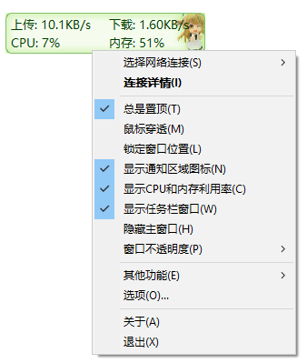
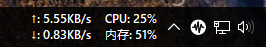
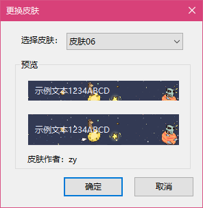

**[简体中文](./README.md) | 繁體中文 | [English](./README_en-us.md)** 

# TrafficMonitor 簡介
Traffic Monitor是一款用於Windows平台的網速監控懸浮窗軟體，可以顯示目前網路速度、CPU及記憶體使用率，支援嵌入到工作列顯示，支援更換面板、歷史流量統計等功能。

# 相關連結：

請[點選此處](https://github.com/zhongyang219/TrafficMonitor/releases/latest)下載TrafficMonitor的最新版本。 
備用連結：[百度網盤下載](https://pan.baidu.com/s/15PMt7s-ASpyDwtS__4cUhg) 提取码：`ou0m` 
如果遇到問題，請[點選此處](https://github.com/zhongyang219/TrafficMonitor/blob/master/Help.md)。 

你也可以[點擊此處](https://github.com/zhongyang219/TrafficMonitor/actions?query=workflow:"Release+CI")下載TrafficMonitor的預發行構建版本。

從1.80版本開始，TrafficMonitor加入了溫度監控功能，如果你不需要溫度監控功能，並且在使用1.80以上版本中遇到了問題，建議下載不含溫度監控的版本。（在Release頁面找到檔名包含`without_temperature`的版本。）

# 主要特性
* 顯示目前實現網路傳輸速率、CPU和記憶體使用率 
* 如果電腦有多個網卡，支援自動和手動選擇網路連線 
* 檢視網路詳細資訊 
* 支援嵌入到工作列顯示 
* 支援更換面板和自訂面板 
* 歷史流量統計 
# 使用說明

**[點選這裡](https://github.com/zhongyang219/TrafficMonitor/wiki)轉到Wiki頁面檢視關於TrafficMonitorr的詳細說明文件。**

# 畫面擷圖

主懸浮窗： 
 
右鍵選單： 
 
工作列視窗： 
 
多彩面板： 
 

# 如何使用
程式啟動後在會在螢幕中顯示一個顯示網速的懸浮窗。在懸浮窗上點選滑鼠右鍵可以彈出右鍵選單。

TrafficMonitor支援將資訊顯示到工作列。但是TrafficMonitor預設只顯示主視窗（懸浮窗），如果需要讓它嵌入到工作列顯示，請在右鍵選單中選擇“顯示工作列視窗”命令。

工作列視窗支援自定義顯示專案，預設情況下只顯示網速，如果需要顯示CPU和記憶體利用率，請在工作列右鍵選單中的“顯示設定”子選單下勾選需要顯示的專案，如下圖所示：

# 自訂面板
 
在主視窗或通知區域圖示右鍵選單上選擇「其他功能」——「更換面板」可以打開更換面板介面。[點選此處](https://github.com/zhongyang219/TrafficMonitorSkin/blob/master/皮肤下载.md)可以下載更多面板。使用者還可以根據自己的需要編輯自己的面板。 
面板檔案放在程式所在目錄的「skins」目錄下，每個面板被放到單獨的資料夾下，資料夾的名稱就是面板的名稱。 
其中「background.bmp」和「background_l.bmp」是背景圖片，「skin.ini」是面板的設定檔，可以透過「skin.ini」指定文字顏色、字型、面板作者、每個專案的大小和位置等資訊。 

從1.80版本開始增加了xml格式的面板配置檔案`skin.xml`，只有xml格式的面板配置檔案才支援溫度和顯示卡使用率顯示。

詳細的面板製作教程請[點選此處](https://github.com/zhongyang219/TrafficMonitor/blob/master/皮肤制作教程.md)。 
推薦使用[面板編輯器](https://github.com/zhongyang219/TrafficMonitorSkinEditor/releases)來建立或編輯面板。 

# 選項設定
 
在右鍵選單選擇「選項...」可以進入選項設定。在選項設定對話方塊中，可以單獨設定主視窗和工作列視窗的文字顏色、字型、背景顏色、網速單位、顯示的文字等。 
在「一般設定」選項分頁中，可以設定是否在程式時自動檢查更新，以及是否需要在開機時自動執行。可以設定在什麼時候需要發出訊息通知。 
從1.72版本開始，支援每個專案文字顏色單獨設定。勾選「指定每個專案的顏色」後，點選「文字顏色」右邊的顏色框，會彈出詳細顏色設定的對話方塊，可以在這裡單獨指定每個專案的顏色。 

# 關於硬體監控功能

從1.80版本開始，TrafficMonitor加入了硬體監控功能（包括溫度監控和顯示卡使用率監控），它使用了第三方開源庫[LibreHardwareMonitor](https://github.com/LibreHardwareMonitor/LibreHardwareMonitor)。如果你在使用溫度監控功能時遇到了問題，請[點選這裡](https://github.com/zhongyang219/TrafficMonitor/blob/master/Help.md#13-关于trafficmonitor温度监控的问题)。

需要注意的是，溫度監控功能默認是關閉的，如果你要使用TrafficMonitor的溫度監控功能，請到[“選項設定”-“常規設定”-“硬體監控”](https://github.com/zhongyang219/TrafficMonitor/wiki/选项设置#硬件监控)中開啟。

**注意：硬體監控功能（包括溫度監控和顯示卡使用率監控）可能存在一些問題，它可能會佔用更多的CPU和記憶體。據部分使用者反饋，開啟溫度功能後會導致程式崩潰和系統宕機等問題，請在知曉以上風險後再決定開啟硬體監控功能。否則，請不要使用硬體監控功能。**

# 更新日誌
**[點選此處檢視更新日誌](./UpdateLog/update_log_zh-tw.md)**

# 關於此專案在Gitee上的倉庫

Gitee上的倉庫僅作為GitHub倉庫的備份，我的所有程式碼提交都是在GitHub上進行，Gitee倉庫會不定期地同步GitHub倉庫的更新。因此Gitee上的倉庫不接受任何pull request，如果你想向TrafficMonitor貢獻你的程式碼，請在GitHub上提交你的pull request。

