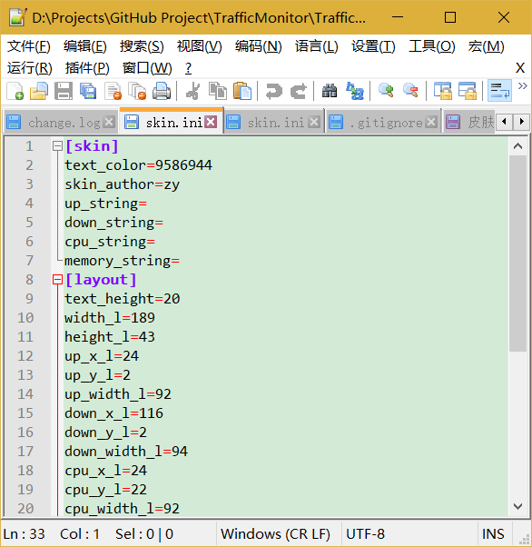
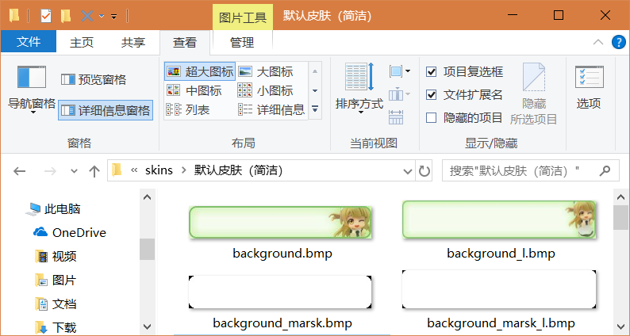

# TrafficMonotor 皮肤制作教程

### 现已推出“TrafficMonitor皮肤编辑器”，制作皮肤更加方便！[点此下载](https://github.com/zhongyang219/TrafficMonitorSkinEditor/releases) 
**相关链接：** 
TrafficMonitor皮肤编辑器使用教程：[点击此处](https://github.com/zhongyang219/TrafficMonitorSkinEditor/blob/master/README.md) 
更多皮肤下载：[点击此处](https://github.com/zhongyang219/TrafficMonitorSkin/blob/master/皮肤下载.md)

---------

Traffic Monitor更换皮肤，并支持自定义皮肤。皮肤文件放在程序所在目录的`skins`目录下，每个皮肤被放到单独的文件夹下，文件夹的名字就是皮肤的名称。 
如果要创建一个新的皮肤，首先在`skins`目录下新建一个文件夹，命名为皮肤的名字。制作好`background.bmp`和`background_l.bmp`两个背景图片放在里面，然后编辑skin.ini文件，`text_color`是该皮肤对应的文字颜色，它是一个WIN32的COLORREF的值，`skin_author`是用于显示到更换皮肤界面中的皮肤作者。 
你可以通过编辑skin.ini中的各个字段来指定悬浮窗的大小、要显示哪些项目，以及每个项目的大小和位置。如下图所示： 
 
skin.ini文件中各项键值的含义如下所示： 

>其中的“默认值”是当skin.ini文件中没有某个键时，程序获得的默认的值。 

**[skin]节：** 

| 键   | 含义              | 默认值 |
| ---- | --------------- | ------ |
| text_color | 文本颜色 | 0 |
| skin_author | 皮肤作者 | unknow |
| up_string | “上传”项目的显示文本 | 上传:  |
| down_string | “下载”项目的显示文本 | 下载:  |
| cpu_string | “CPU”项目的显示文本 | CPU:  |
| memory_string | “内存”项目的显示文本 | 内存:  |

**[layout]节:** 
* 注意：V1.69及以前版本不支持[layout]节。

| 键   | 含义              | 默认值 |
| ---- | --------------- | ------ |
| text_height | 每个项目的高度 | 20 |
| no_text | 不显示数值前面的“上传”、“下载”等文本 | 0 |
| preview_width | 皮肤预览图的宽度 | 238 |
| preview_height | 皮肤预览图的高度 | 105 |

勾选“显示更多项目”时的布局：

| 键   | 含义              | 默认值 |
| ---- | --------------- | ------ |
| width_l | 窗口的宽度 | 220 |
| height_l | 窗口的高度 | 43 |
| up_x_l | “上传”的x坐标 | 6 |
| up_y_l | “上传”的y坐标 | 2 |
| up_width_l | “上传”的宽度 | 108 |
| up_align_l | “上传”的对齐方式 | 0 |
| down_x_l | “下载”的x坐标 | 114 |
| down_y_l | “下载”的y坐标 | 2 |
| down_width_l | “下载”的宽度 | 110 |
| down_align_l | “下载”的对齐方式 | 0 |
| cpu_x_l | “CPU”的x坐标 | 6 |
| cpu_y_l | “CPU”的y坐标 | 21 |
| cpu_width_l | “CPU”的宽度 | 108 |
| cpu_align_l | “CPU”的对齐方式 | 0 |
| memory_x_l | “内存”的x坐标 | 114 |
| memory_y_l | “内存”的y坐标 | 21 |
| memory_width_l | “内存”的宽度 | 110 |
| memory_align_l | “内存”的对齐方式 | 0 |
| show_up_l | 是否显示“上传” | 1 |
| show_down_l | 是否显示“下载” | 1 |
| show_cpu_l | 是否显示“CPU” | 1 |
| show_memory_l | 是否显示“内存” | 1 |
| preview_x_l | 在“选择皮肤”界面中预览图的x坐标 | 0 |
| preview_y_l | 在“选择皮肤”界面中预览图的y坐标 | 47 |

不勾选“显示更多项目”时的布局：

| 键   | 含义              | 默认值 |
| ---- | --------------- | ------ |
| width_s | 窗口的宽度 | 220 |
| height_s | 窗口的高度 | 28 |
| up_x_s | “上传”的x坐标 | 6 |
| up_y_s | “上传”的y坐标 | 4 |
| up_width_s | “上传”的宽度 | 108 |
| up_align_s | “上传”的对齐方式 | 0 |
| down_x_s | “下载”的x坐标 | 114 |
| down_y_s | “下载”的y坐标 | 4 |
| down_width_s | “下载”的宽度 | 110 |
| down_align_s | “下载”的对齐方式 | 0 |
| cpu_x_s | “CPU”的x坐标 | 0 |
| cpu_y_s | “CPU”的y坐标 | 0 |
| cpu_width_s | “CPU”的宽度 | 0 |
| cpu_align_s | “CPU”的对齐方式 | 0 |
| memory_x_s | “内存”的x坐标 | 0 |
| memory_y_s | “内存”的y坐标 | 0 |
| memory_width_s | “内存”的宽度 | 0 |
| memory_align_s | “内存”的对齐方式 | 0 |
| show_up_s | 是否显示“上传” | 1 |
| show_down_s | 是否显示“下载” | 1 |
| show_cpu_s | 是否显示“CPU” | 0 |
| show_memory_s | 是否显示“内存” | 0 |
| preview_x_s | 在“选择皮肤”界面中预览图的x坐标 | 0 |
| preview_y_s | 在“选择皮肤”界面中预览图的y坐标 | 0 |

>注： 
* 其中的对齐方式：0：左对齐；1：右对齐；2：居中
* TrafficMonitor完美支持高DPI显示器，以上所有的字段的单位均为DPI设定为100%时的像素值，如果你的电脑的DPI设置大于100%，在显示时所有数据会根据DPI进行等比例缩放，因此，你不需要为不同的DPI设置而修改任何字段的数值。 
* 背景图片`background.bmp`和`background_l.bmp`的尺寸不需要和width_l、height_l以及width_s、height_s的值一致，但是长宽比应该一致，否则会导致拉伸变形。实际悬浮窗的大小会根据skin.ini中的指定的大小进行DPI缩放后拉伸图片。同时建议实际图片尺寸应该大于skin.ini中的指定的大小，这样可以使程序在更多高DPI显示器中也能获得清晰的显示效果。 
* 如果新增了皮肤，需要重新启动一下软件才能在“更换皮肤”界面中看到新增的皮肤。 
* 如果不需要在皮肤中指定显示的文本，请将no_text键设为0，此时`选项设置`——`主窗口设置`中的显示文本和“交换上传和下载的位置”选项不可用。

## 不规则形状的皮肤
从1.71版本开始，程序支持不规则形状的皮肤。 
要制作不规则形状的皮肤，需要制作两个掩码图片：`background_mask.bmp`和`background_mask_l.bmp`。其中用白色表示需要保留的部分，黑色表示需要裁剪的问题。如下图所示。 
 
其中，两个掩码图片不一定要和两个背景图片尺寸一致，也不一定要和skin.ini中定义的窗口大小一致，但是最好应该和背景图片尺寸一致，且长宽比应该一致。和背景图片一样，掩码图片在被载入时会拉伸成skin.ini中设定的尺寸。 
在载入掩码图片时，程序采用的逻辑是：依次检查掩码图片的每个像素，将像素的RGB取平均值得到颜色的亮度，如果亮度值大于128，则将该像素设置为保要留的区域，反之，则设置为要裁剪的区域。
